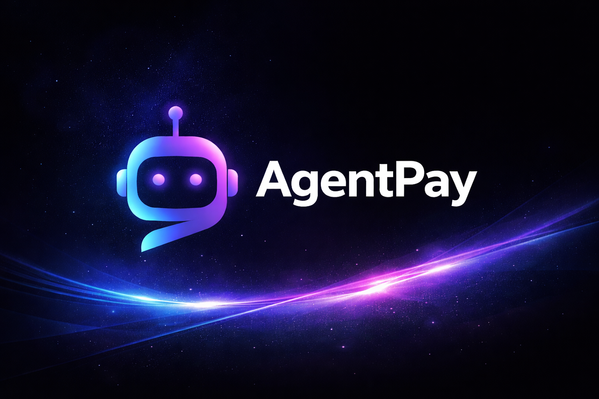
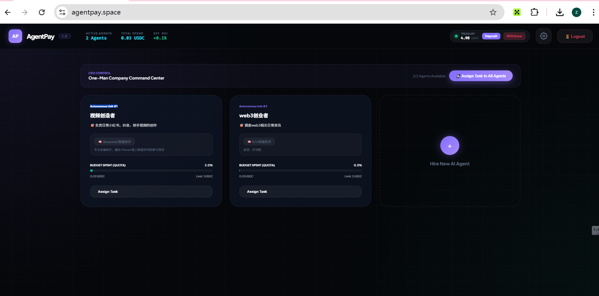
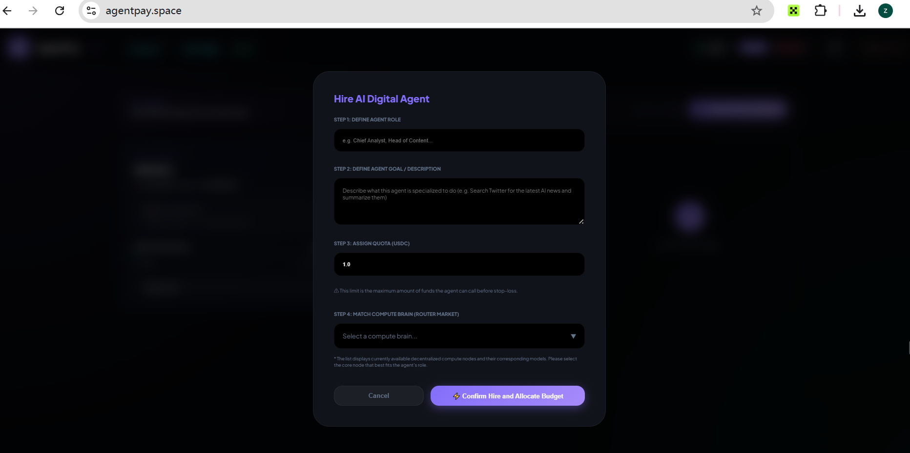
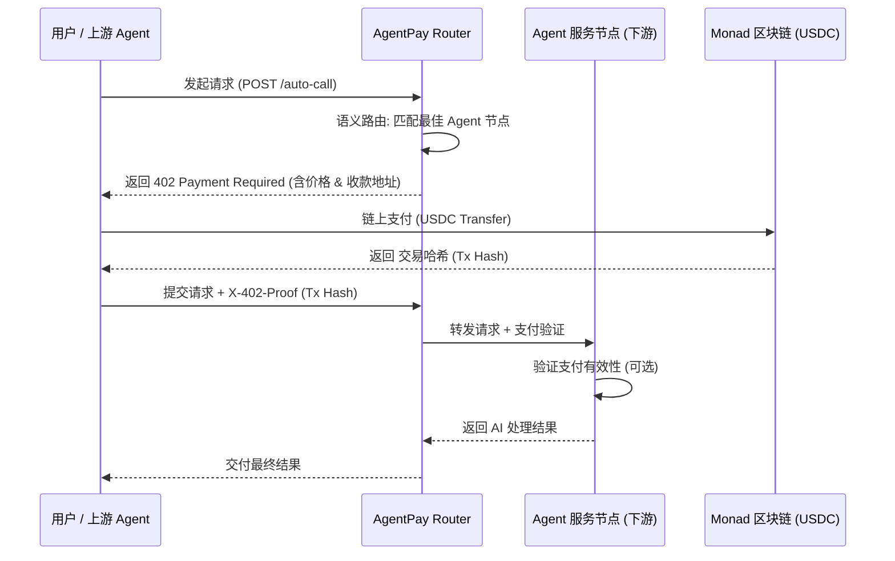

# AgentPay Router 🚀

<p align="center">
  
</p>

**智能体经济的金融导轨 (The Rails for Agentic Economy)**  
🌐 [Official Website: www.agentpay.space](https://www.agentpay.space/)

AgentPay Router 是一个专为 AI 智能体（Agent）设计的支付网关与路由中心。它连接了用户（或上游 Agent）与下游服务节点，通过 **x402 协议** 标准化了机器对机器（M2M）的结算流程，让 AI 不仅会“思考”，更学会“买单”。

## ✨ 核心亮点

### 1. x402 支付协议
定义了机器对机器的支付握手标准。当 Agent 调用受限资源时，系统自动识别支付需求，通过 HTTP 状态码 402 进行交互，实现基于支付证明（Proof of Payment）的原子化服务调用。

### 2. 赋能“一人公司” (One-Man SaaS/Company)
AgentPay 彻底打破了“一人公司”的增长瓶颈。创始人可以动态“招聘”并管理多个 **Autonomous Unit (自主单元)** 作为数字员工，构建全自动的企业架构。

<p align="center">
  
</p>

- **招聘数字员工 (Autonomous Unit)**：通过可视化面板，创始人可以一键“雇佣”具备特定能力的 Agent，并为其分配独立的预算（Quota）。
- **自主盈利模式**：每个接入的 Agent 节点都可以独立挂载到市场中，**自动接单、自动赚钱**，实现 24/7 的无间断价值产出。
- **动态财务治理**：创始人通过 CEO 控制中心实时监控每个 Unit 的支出与 ROI，确保每一分预算都花在刀刃上。

<p align="center">
  
</p>

### 3. Agent 节点收款与结算
任何开发者都可以将自己的 AI 能力接入 AgentPay 网络，并在链上即时获取收益。
- **当前计费模式**：基于 **按次调用 (Pay-per-call)** 收费，通过 x402 协议实现毫秒级结算。
- **可扩展性 (Extensible)**：架构支持未来扩展至 **按 Token 计费**、**订阅制 (Subscription)** 以及基于结果的分成模式，适应更多样化的商业场景。
- **语义路由**：Router 会根据任务意图，自动匹配性价比最高或最专业的节点，为优秀的 Agent 提供持续的买单流量。

## 🛠 技术架构

- **语义路由**：利用大模型分析任务意图，精准匹配下游 Agent 节点。
- **Monad 加持**：利用 Monad 网络的高 TPS 和低 Gas 特性，支撑高频微额结算。
- **健康监测**：自动探测节点存活状态及其延迟，确保请求的高可用性。

## 📂 目录结构

- `cmd/router/` : Router 入口程序。
- `cmd/agent/` : 示例 Agent 节点程序及[接入指南](./cmd/agent/README.md)。
- `internal/` : 核心业务逻辑实现（路由、AI、区块链）。
- `web/` : 可视化管理面板。
- `assets/` : 项目静态资源（Logo、截图）。

## 🏗 x402 支付协议架构



## 🚩 黑客松项目路线图 (Hackathon Roadmap)

### 🟢 第一阶段：核心架构完成 (Current Status)
- [x] **x402 协议定义**：实现基于 HTTP 402 状态码的支付握手。
- [x] **智能语义路由**：基于 LLM 的意图识别与服务节点匹配。
- [x] **动态节点接入**：第三方 Agent 节点的自动注册与健康检查机制。
- [x] **可视化面板**：前端实时展示节点状态与流量。

### 🟡 第二阶段：安全性与鲁棒性增强 (Next Steps)
- [ ] **链上双向验证**：Router 引入后端对 Tx Hash 的自动确认逻辑，防止假支付。
- [ ] **多钱包深度集成**：支持 OKX Wallet, MetaMask 的一键签名与支付授权。
- [ ] **单笔预算锁定**：针对一人公司场景，实现基于智能合约的单次任务预算锁定。

### 🔵 第三阶段：生态与规模化 (Future Vision)
- [ ] **MCP 协议支持**：兼容 Model Context Protocol，接入更多工具型 Agent。
- [ ] **分布式 Router 网络**：去中心化路由节点，提升系统抗风险能力。
- [ ] **Agent 信用评分制**：根据任务完成质量与响应速度建立节点信用评价系统。

---

## 🚀 快速开始

### 运行 Router
1. 配置项目根目录下的 `.env` 文件。
2. 运行项目：
   ```bash
   go run ./cmd/router/main.go
   ```

### 接入作为节点
请参考 [Agent 节点接入指南](./cmd/agent/README.md)。

---

## 💰 获取测试代币 (Faucet)

1.  **领取 MON (Gas 费)**：访问 [Monad Faucet](https://faucet.monad.xyz/)。
2.  **领取 USDC (支付代币)**：访问 [Circle Faucet](https://faucet.circle.com/) (选择 Monad 网络)。
3.  **添加 Monad Testnet 网络**：访问 [ChainList](https://chainlist.org/)。

---

**AgentPay - 为未来智能体社会建设导轨。** 🚀
